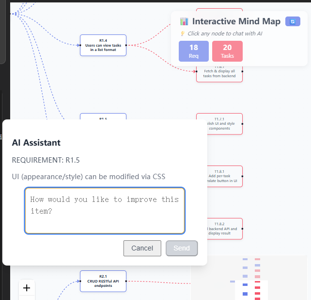
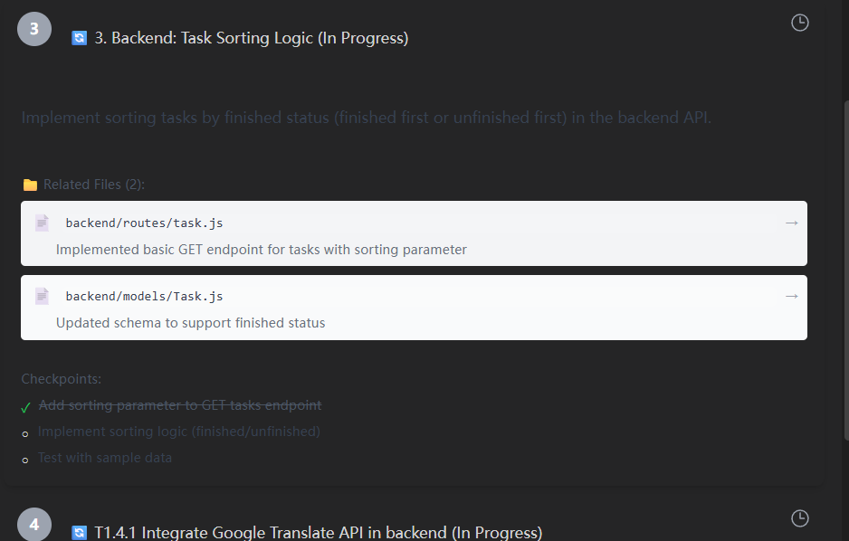

<div align="center">


</div>

<h1 align="center">Continue</h1>

<div align="center">

**[Continue](https://docs.continue.dev) enables developers to create, share, and use custom AI code assistants with our
open-source [VS Code](https://marketplace.visualstudio.com/items?itemName=Continue.continue)
and [JetBrains](https://plugins.jetbrains.com/plugin/22707-continue-extension) extensions
and [hub of models, rules, prompts, docs, and other building blocks](https://hub.continue.dev)**

</div>

<div align="center">

<a target="_blank" href="https://opensource.org/licenses/Apache-2.0" style="background:none">
    
</a>
<a target="_blank" href="https://docs.continue.dev" style="background:none">
    
</a>
<a target="_blank" href="https://changelog.continue.dev" style="background:none">
    
</a>
<a target="_blank" href="https://discord.gg/vapESyrFmJ" style="background:none">
    
</a>

<p></p>

## Agent

[Agent](https://continue.dev/docs/agent/how-to-use-it) enables you to make more substantial changes to your codebase


## Chat

[Chat](https://continue.dev/docs/chat/how-to-use-it) makes it easy to ask for help from an LLM without needing to leave
the IDE


## Autocomplete

[Autocomplete](https://continue.dev/docs/autocomplete/how-to-use-it) provides inline code suggestions as you type


## Edit

[Edit](https://continue.dev/docs/edit/how-to-use-it) is a convenient way to modify code without leaving your current
file


</div>

## Getting Started

Learn about how to install and use Continue in the docs [here](https://continue.dev/docs/getting-started/install)

## Contributing

Read the [contributing guide](https://github.com/continuedev/continue/blob/main/CONTRIBUTING.md), and
join [#contribute on Discord](https://discord.gg/vapESyrFmJ).

## Web-dev Usage

1. If GUI is modified only, run this in GUI folder
   ```
   npm run build
   ```
2. Then, in extensions/vscode foler
   ```
   npm run prepackage
   npm run package
   ```

## Features

### Fundamental Knowledge Support

1. In Markdown documents:
   - Select a piece of text and press `Ctrl+E` to get an explanation.
   - Select a piece of text and press `Ctrl+Shift+Q` to initiate a quick conversation.
2. In the mind map:
   - Left-click on a node to start a quick chat.
   - Right-click on a node to ask a question, such as requesting the agent to break down a task.
    <div style="display: flex; justify-content: center; gap: 10px;">
       
       
   </div>
3. In the task panel:
   - Select a specific section of a task to inquire about knowledge. The inquiry results are saved in the corresponding task.
     
4. In the chat flow:
   - Support simple knowledge viewing between lines.
   - Select a piece of text to perform predefined inquiries.
     
     

### Working Flow

1. During the initialization phase, the agent clarifies requirements through questions and generates `requirements.md`.
2. After generating the requirements, the agent further clarifies and produces `task.md` and `re-plan.md`. The `re-plan.md` is visualized in the mind map.
3. The agent guides the project step by step. After completing a task or checkpoint, the agent updates the corresponding documents (e.g., logs of related files for each task are updated in real-time), which are reflected in the task panel.
   

### Explainability

1. Full codebase structure analysis.
   
2. File Explanation
   
3. Prompts: Rules for guiding full-stack beginners.

## License

[Apache 2.0 © 2023-2024 Continue Dev, Inc.](./LICENSE)
